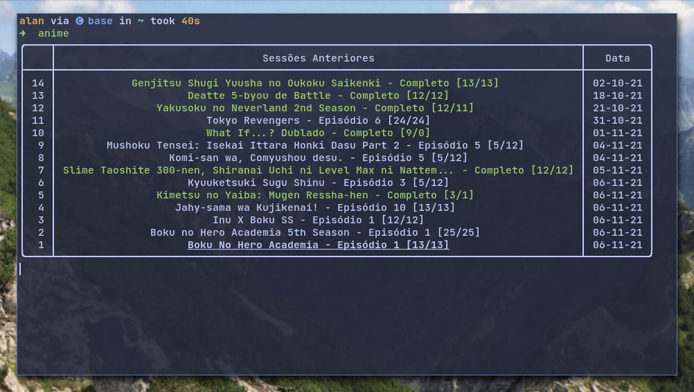

# goyabu-cli

## assista animes diretamente do terminal

digite `anime` e siga as instruções para utilizar.

>Parametros:
>
> -  `--episodes` episódio ou intervalo de episódios
> -  `--player` player a ser utilizado
> -  `--silent` mostrar o pouca informação na tela
> -  `--update` atualizar os episódios salvos
> -  `-y` aceite todas as opções padrões

## Instalação

Na pasta do programa, execute no terminal `bash install.sh`

## Instalação manual

O programa não foi testado no windows, por isso não há garantia que funcione em outros sistemas operacionais.

Execute `pip install -r requirements.txt`

Assim o programa pode ser executado com `python anime.py` 
