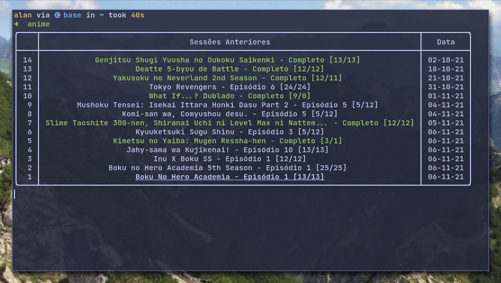

# goyabu-cli

<!--## assista animes diretamente do terminal-->
## 😎 Watch animes without leaving the terminal!

<!--digite `anime` e siga as instruções para utilizar.-->
## 🚀 How to use

Type `anime` in the terminal and enjoy 😊

<!--Parametros:-->
<!-- -  `--episodes` episódio ou intervalo de episódios-->
<!-- -  `--player` player a ser utilizado-->
<!-- -  `--silent` mostrar pouca informação na tela-->
<!-- -  `--update` atualizar os episódios salvos-->
<!-- -  `-y` aceite todas as opções padrões-->
> Arguments:
>
> -  `--episodes` range of episodes
> -  `--player` player to watch (default: mpv)
> -  `--silent` minimal information on screen
> -  `--update` only update the watched list
> -  `-y` accept the default entries

<!--## ⚙ Instalação-->
## 📦 Installation

Requirements:
- Python 3
- MPV player (or any other video player)

<!--Clone este repositório e, na pasta do programa, execute o comando `bash install.sh`-->

Clone this repository and run the install script

`git clone 'https://github.com/AlanJs26/goyabu-cli' && cd goyabu-cli && ./install.sh`

<!--Com isso digitando `anime` no terminal, o programa deve funcionar-->

To run the program type `anime` in the terminal

<!--## Instalação manual-->
## ⚙ Manual installation

Clone this repository `git clone 'https://github.com/AlanJs26/goyabu-cli' && cd goyabu-cli` 

Install all pythons dependencies `pip install -r requirements.txt`

<!--Assim o programa pode ser executado com `python anime.py` -->
To run the program, type `python anime.py` in the program folder or add to system path

## ⚠️ Warning

Currently all animes are being indexed through [Goyabu](https://goyabu.com), so all subtitles are in **Portuguese**  

I have plans to add **English** support along with TV shows and movies, but this will take a while  

